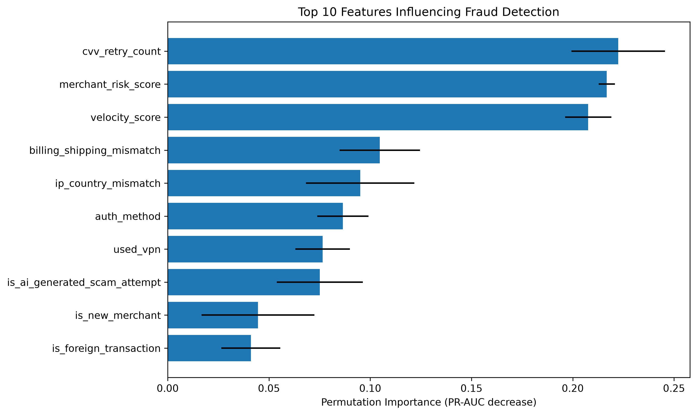

# VaultGuard

VaultGuard is a Streamlit-based credit-card fraud monitoring prototype. It scores uploaded transactions with a trained machine-learning pipeline, prioritizes suspicious activity for investigation, and makes model evaluation visible to analysts.

> Educational decision-support only. VaultGuard must not automatically approve, decline, or block real customer transactions.

## Product capabilities

- **Fraud Scanner:** Upload a CSV, choose an alert threshold, and score every transaction.
- **Monitoring dashboard:** Review transactions analyzed, fraud alerts, alert rate, amount at risk, and risk distribution.
- **Investigation queue:** Sort alerts by fraud probability, inspect a transaction, and see plain-language risk reasons.
- **CSV export:** Download the original transaction fields together with probabilities, predictions, risk levels, and investigation reasons.
- **Model Information:** Review model comparison results, the precision/recall/F1 trade-off, and permutation feature importance.

## Model results

The saved evaluation reports use a stratified 80/20 hold-out split of 20,000 transactions (339 fraud cases overall). Logistic Regression was selected because it had the strongest PR-AUC.

| Model | Precision | Recall | F1 | ROC-AUC | PR-AUC |
| --- | ---: | ---: | ---: | ---: | ---: |
| Logistic Regression | 10.66% | 80.88% | 18.84% | 93.47% | 43.77% |
| Random Forest | 100.00% | 1.47% | 2.90% | 90.10% | 16.83% |

The saved default alert threshold is **0.90**. On the hold-out set it produced 135 alerts with 29.63% precision, 58.82% recall, and a 39.41% F1 score. The dashboard slider makes the operational precision–recall trade-off explicit.

## Screenshots

Run the app locally, score `data/sample_transactions.csv`, then capture the Scanner, Dashboard, and Model Information pages. Store portfolio screenshots in `reports/figures/` before publishing the repository.

The generated permutation-importance chart is saved at `reports/figures/feature_importance.png`:



## Run locally

```powershell
python -m venv venv
venv\Scripts\Activate.ps1
pip install -r requirements.txt
python -m src.train
python -m src.feature_importance
python -m streamlit run app.py
```

Open the local URL shown by Streamlit, select **Fraud Scanner**, and upload `data/sample_transactions.csv`.

## Project structure

```text
VaultGuard/
├── app.py                         # Streamlit monitoring product
├── data/                          # Training data and sample upload
├── models/                        # Trained pipeline and configuration
├── notebooks/07_feature_importance.ipynb
├── reports/                       # Metrics, threshold analysis, figures
└── src/
    ├── train.py                   # Training and model selection
    ├── preprocessing.py           # Shared preprocessing pipeline
    └── feature_importance.py      # Reproducible importance report
```

## Deployment

Commit the source, requirements, models, and reports to your GitHub repository, then create a Streamlit Community Cloud app using `app.py` as the entry point. Do not commit private customer data, credentials, or production model secrets.
